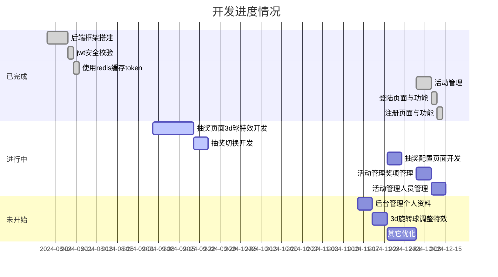

## 项目简介
lottery-annual宗旨是打造一个简单的抽奖系统，通过简单的配置，快速开始一个抽奖活动。本人是一名JAVA开发人员，目前正在学习Golang，学以致用，以此记录自己的学习成果，有很多不足之处，欢迎交流指正，在此不胜感激！！！

## 部分截图

- 签到页面

  

- 抽奖页面

  

- 活动设置相关

  

- 登录页面

  

- 注册页面

  

- 活动管理相关

  

## 技术选型

本着方便开发，快速学习，项目太小，前后端不分离！！！

- ##### 前端相关

  抽奖首页：3D照片球改造，three.js

  后台管理：jquery、bootstrap相关如bootstrap-table、bootstrap-validate、bootstrap-datepicker、layer等等，

  在此，感谢 笔下光年 提供的模板 <a> https://gitee.com/yinqi/Light-Year-Admin-Template</a>

- ##### 后端相关（go+gorm+redis）

  语言：Golang

  缓存Redis：redigo

  数据库：gorm

  安全：dgrijalva

  感谢后端 张奇峰 的go框架：<a> https://gitee.com/daitougege/GinSkeleton</a>

  

## 快速开始

1. 拷贝项目 git  clone  https://github.com/mingdw/lottery_annual.git

2. 执行脚本

   找到doc目录的lottery-annual.sql

3. 修改数据库配置

   找到resource 的-dev，修改数据库配置

4. 启动

   cd 到项目根目录，执行命令 go run lotteryStartMain.go

## 里程碑

